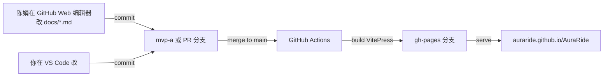

# ADR-001 · 在线协作文档平台选型

> **状态**: ✅ 已决定 — VitePress + GitHub Pages(陈娟会用 git,不需要 Dhub 等 SaaS 编辑器)
> **日期**: 2026-06-18(v2,基于用户反馈)
> **作者**: chenzhuowen + Claude
> **上下文**: [`ROADMAP-mvp-a.md`](../工程/ROADMAP-mvp-a.md) M1

## 用户最终需求(原话节选)

> "我非常想用 gh page"
> "陈娟其实 GitHub 和 git 都会用,我带着她在这个仓库协作没问题的"
> "希望排版可以好一些,md 其实如果支持部分 html、xml、mermaid 等,就还好"

## 关键事实(deep-research + 复核)

| 事实 | 来源 |
|---|---|
| 任何**实时协作富文本**编辑器都需要后端(Postgres + Yjs WebSocket),GH Pages 这种"纯静态托管"承载不了 | [Docmost docs](https://docmost.com/docs/) |
| **VitePress** 是 Vue 团队官方静态站生成器,首页/侧边栏/中文搜索/暗色模式/CMS 风格全有,markdown 当源,GitHub Pages 一键部署 | [vitepress.dev](https://vitepress.dev/) |
| **Mermaid** 支持:`vitepress-plugin-mermaid` 一行配置,在 markdown 里写 ` ```mermaid ` 块就渲染 | [npmjs](https://www.npmjs.com/package/vitepress-plugin-mermaid) |
| Markdown 原生**支持 HTML 内联**(VitePress 也支持 Vue 组件),写复杂排版可以混 HTML | [CommonMark](https://commonmark.org/) |
| **PlantUML / D2 / Excalidraw** 都有 markdown-it 插件可装入 VitePress | 各插件 npm 主页 |

## 决定

**VitePress + GitHub Pages + 几个图表插件 + GitHub Web UI 协作。**

不用任何 SaaS 编辑器(Dhub/Forestry/TinaCMS),理由:
- 陈娟会 git,直接在 GitHub Web 编辑器或 VS Code 改 markdown,体验已经够好
- 少一层 SaaS = 少一个故障点 = 少一份"被关停"的风险(Notion 国内每年都有抖动事故)
- 仓库即真相源,符合 OpenAI harness engineering 的"对 agent 而言,仓库外的内容不存在"

## 技术栈

```
docs/                            ← 已有 7 份 markdown,直接当 VitePress 的源
├── .vitepress/
│   ├── config.ts                ← 站点导航 / 主题 / 插件配置
│   └── theme/                   ← 可选自定义主题(暂用默认)
└── *.md                         ← manifesto / PRD / ADR / ...
```

**计划装的插件**:
| 插件 | 作用 |
|---|---|
| `vitepress-plugin-mermaid` | 流程图、时序图、状态机、ER 图、甘特图(Mermaid 语法) |
| `markdown-it-plantuml` | 类图、用例图、组件图(PlantUML 语法,XML/DSL 风) |
| `markdown-it-mathjax3` | 数学公式(`Σ` `argmax` 这些 manifesto §4 用到的) |
| `vitepress-plugin-search` 或内置 `themeConfig.search` | 中文全文搜索 |

> **关于"XML 图表"**:你说的应该是类似 PlantUML / Draw.io 那种 XML-描述的图。Mermaid 自身不是 XML,但 90% 的常见图(流程/时序/状态/ER/甘特/思维导图)它都能搞;Mermaid 不擅长的,PlantUML 兜底。两个插件并存即可。
> 如果要复杂插画(像 Excalidraw 那种手绘风),可以**画完导出 SVG 再嵌进 markdown**,VitePress 直接支持 `` 和原生 SVG。

## 部署架构



每次 push,GH Actions 自动跑 `pnpm docs:build` → 把 `docs/.vitepress/dist` 推到 `gh-pages` 分支,GitHub Pages 自动发布。**完全免费,零运维。**

## 国内访问风险与对策

| 风险 | 影响 | 对策 |
|---|---|---|
| GH Pages 国内访问偶有抖动 | 陈娟个别时段打不开 | (1) GitHub Web 编辑器走代理 (2) 装 VS Code 本地预览 `pnpm docs:dev` 离线编辑 (3) 极端情况镜像一份到阿里云 OSS(等真需要再做,免费额度内) |
| GitHub Web 编辑器中文搜索差 | 找老文档慢 | VitePress 站本身就有全文搜索,导航树清晰,基本不用在仓库搜 |

## 落地动作清单(我可以一次做完,~30 分钟)

1. `pnpm add -D vitepress vitepress-plugin-mermaid markdown-it-plantuml` 等
2. 写 `docs/.vitepress/config.ts`:
   - 站点标题、logo、Hero 文案
   - 左侧导航把 manifesto 摆第一,然后 PRD / 信息架构 / 作品说明 / ADR / ROADMAP
   - 顶部链接到 GitHub 仓库
3. 给 `package.json` 加 scripts:`docs:dev`、`docs:build`、`docs:preview`
4. 写 `.github/workflows/docs.yml`:每次推 `main` 自动构建 + 发到 `gh-pages` 分支
5. 仓库 Settings → Pages → Source 选 `gh-pages` 分支
6. 在 manifesto 顶部加一个 mermaid 流程图(演示图表能力,顺便让陈娟看到效果)
7. 写一份 `docs/HOW-TO-EDIT.md` 给陈娟:三种改文档的方式(GitHub Web / VS Code / 本地 `pnpm docs:dev` 预览)

## 引用

- VitePress: https://vitepress.dev/
- VitePress + Mermaid 插件: https://emersonbottero.github.io/vitepress-plugin-mermaid/
- Mermaid 语法: https://mermaid.js.org/intro/
- PlantUML 语法: https://plantuml.com/zh/
- GitHub Pages 文档: https://docs.github.com/zh/pages
- OpenAI Harness Engineering(仓库即真相源的理由): https://openai.com/index/harness-engineering/
